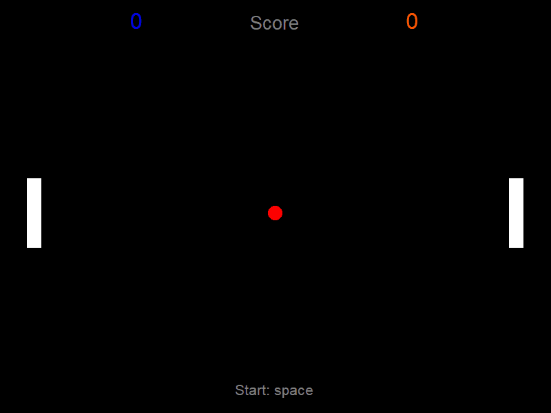

# 🏓 Self Pong

A two-player Pong game built in Python using the Turtle graphics library — made from scratch.



---

## Features

- Two-player local multiplayer
- Space to start each round — ball doesn't move until you're ready
- Alternating serve direction each round
- Randomized launch angle every round
- Ball speeds up with each paddle hit
- Bounce counter during play
- High score tracker across rounds
- Paddles reset to center after each round
- Smooth hold-to-move paddle controls
- Clean exit on window close

---

## Controls

| Action | Player 1 (Left) | Player 2 (Right) |
|---|---|---|
| Move Up | `W` | `I` |
| Move Down | `S` | `K` |
| Start Round | `Space` | `Space` |

---

## Requirements

- Python 3.x
- No external dependencies — uses only the Python standard library

---

## Running the Game

```bash
python V1_pong.py
```

---

## What I Learned

Built as a one-day project to practice Python fundamentals — game loops, collision detection, state management, keyboard input handling, and frame rate control using `time.sleep()`.

---

*V1 — single session build. V2 coming soon with single-player mode.*